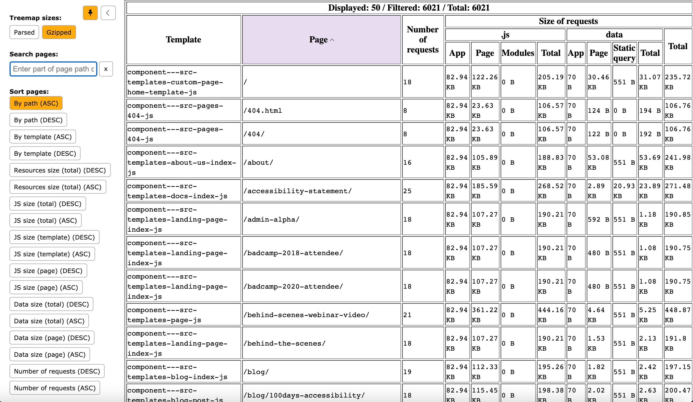

**gatsby-plugin-perf-budgets** is an *experimental* plugin to make browsing bundles on a page basis easier. It is used in conjunction with `gatsby-plugin-webpack-bundle-analyser-v2`. 

## Installation

```
npm i gatsby-plugin-webpack-bundle-analyser-v2 -D
npm i gatsby-plugin-perf-budgets -D
```

or

```
npm i gatsby-plugin-webpack-bundle-analyser-v2 -D
npm i gatsby-plugin-perf-budgets -D
```

## Usage

Include the plugin in your `gatsby-config.js` file :

```javascript:title=gatsby-config.js
// In your gatsby-config.js
plugins: [
    `gatsby-plugin-perf-budgets`,
    `gatsby-plugin-webpack-bundle-analyser-v2`
]
```

## Example



## Features

`gatsby-plugin-perf-budgets` generates a report, located at `/_report.html` from the site root, breaking down bundle size by route, break down global "app" bundle vs template-specific bundles, and separate out JavaScript versus data sizes.

* Sort by template, page size, or path
* Search/filter by path

When you click into a route you can see bundle sizes as generated by `gatsby-plugin-webpack-bundle-analyser-v2`. The Gatsby documentation has [an overview to understanding (and optimizing) the results](https://www.gatsbyjs.com/docs/how-to/performance/improving-site-performance/#step-1-profile-your-bundle).

## Contributing
Contributions are welcome!

### License
MIT